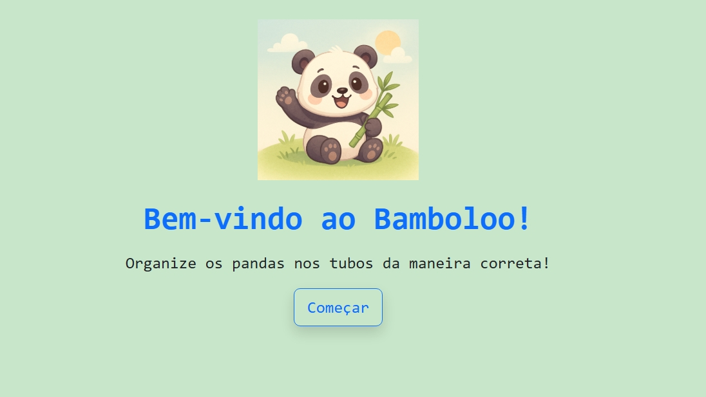

# 🐼 Bamboloo – Um Jogo de Quebra-Cabeça com Pandas

**Bamboloo** é um jogo casual e relaxante onde seu objetivo é organizar pandas coloridos em tubos até que todos estejam agrupados por cor. Inspirado em jogos como *Water Sort Puzzle*, com um toque de fofura e identidade visual própria!

## 🎮 Como Jogar

- Clique em um tubo para selecionar um panda do topo.
- Em seguida, clique em outro tubo para mover o panda.
- Só é possível mover pandas para tubos com espaço e onde a cor seja igual ou esteja vazio.
- Complete todos os tubos com pandas da mesma cor para vencer o nível.

## 🌈 Níveis

O jogo possui **5 níveis**, com dificuldade progressiva:
1. 🐾 Nível 1 – 2 cores
2. 🎋 Nível 2 – 3 cores
3. 🌈 Nível 3 – 4 cores
4. 💜 Nível 4 – 5 cores 
5. 🧠 Nível 5 – desafio extra!

## 🔗 Jogue agora!

👉 [Clique aqui para jogar Bamboloo](https://erlizaellen.github.io/bamboloo/)

## 🧪 Tecnologias Utilizadas

- **HTML5** + **CSS3**
- **Bootstrap 5**
- **JavaScript (ES6+)**
- **SweetAlert2** (alertas)
- **GitHub Pages** (deploy)
- Imagens/ilustrações geradas com IA

## 📸 Captura de tela



## 🚀 Como rodar localmente

```bash
git clone https://github.com/erlizaellen/bamboloo.git
cd bamboloo
open index.html
